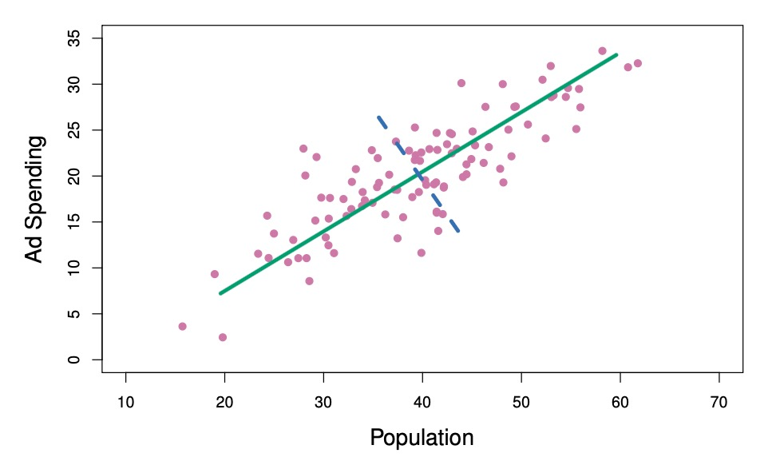

\newpage

This report presents the submission of **Group 1** for the **Time Series Analysis and Machine Learning** course (HS-2025). There are two exercises in this assignment. **First**, we replicated both panels in *James — An Introduction to Statistical Learning with Applications in R* (Figure 6.4), which displayed the standardized ridge regression coefficients of the credit data set. **Second**, we explained how the two principal component lines in Figure 6.14 were derived, including their meaning and why they are orthogonal to each other.

```{r setup, include=FALSE}
library(knitr)
opts_chunk$set(echo = TRUE, message = FALSE, warning = FALSE)
```

# Exercise 1

## 1. Data Preparation

We started by importing the necessary libraries used throughout the project.

```{r libraries}
# for lm.ridge
library(MASS)
```

The raw credit_data.csv file is read and the binary Yes/No indicators for the predictors "Own","Student", and "Married" are converted into numeric binary variables. This conversion ensures that the model correctly interprets these predictors as binary inputs, with “Yes” corresponding to 1 and “No” corresponding to 0.

```{r load-clean}
# Load data and convert categorical Yes/No flags to 0/1 dummies
data <- read.csv("credit_data.csv")

data$Student <- ifelse(data$Student == "Yes", 1, 0)
data$Own     <- ifelse(data$Own     == "Yes", 1, 0)
data$Married <- ifelse(data$Married == "Yes", 1, 0)
```

The categorical predictor "Region" is transformed into three dummy variables representing the regions South, West, and East. These dummy variables are created without including an intercept (in order to avoid perfect multicollinearity), allowing each region to be treated as a separate category in the design matrix. The new indicator variables are appended to the dataset for subsequent analysis.

```{r region-dummies}
# Build Region indicators and bind them to the main data frame
region_dummies <- model.matrix(~ Region - 1, data = data)
data <- cbind(data[ , !(names(data) %in% "Region")], region_dummies)
```

After implementing the four modifications described above, the cleaned dataset is visualized to inspect for potential inconsistencies or data entry errors.

```{r view-data, eval=FALSE}
View(data)
```

## 2. Design Matrix Construction

In this step, we identify the relevant predictors and the response variable to be used in our regression model. The predictor set includes both continuous variables (such as income, limit, and rating) and binary or categorical variables (such as married and region).

To enhance the interpretability and comparability of the model, we standardize all predictors so that each has a mean of zero and a standard deviation of one. Standardization ensures that no variable dominates the estimation simply because it is measured in larger numeric units. It also allows ridge regression to apply the same degree of shrinkage to all coefficients, which improves the stability and comparability of the results.

Without standardization, the penalization term in ridge regression would depend not only on the regularization parameter $\lambda$ but also on the scale of the $j$th predictor (see formula 6.6).

```{r design-matrix}
# Define predictor matrix X and response vector Y
X <- dplyr::select(
  data,
  Income, Limit, Rating, Cards, Age, Education,
  Own, Student, Married,
  RegionEast, RegionWest, RegionSouth
)
Y <- data$Balance

# Standardize predictors to mean 0, variance 1
# We work with the already build in scale function instead of the equation given in the book 
X_standardized <- scale(X)
X_std <- as.data.frame(X_standardized)
```

## 3. Helper Functions

To make the analysis easier and more consistent, we define two short helper functions that perform the key calculations used throughout the report.  
The first function computes the ridge regression coefficients for a given value of the regularization parameter `lambda` following the model:
$$
\hat{\beta}_{\lambda} = \underset{\beta}{\arg\min} 
\left\{
\sum_{i=1}^{n} (y_i - x_i^\top \beta)^2 + 
\lambda \sum_{j=1}^{p} \beta_j^2
\right\}
$$
The second function computes the ordinary least squares (OLS) coefficients without an intercept following the model: 
$$
\hat{\beta}_{OLS} = \underset{\beta}{\arg\min}
\left\{
\sum_{i=1}^{n} (y_i - x_i^\top \beta)^2
\right\}
$$

```{r helper-functions}
# Ridge coefficients for a chosen penalty lambda
compute_coefficients <- function(lambda, X, y) {
  ridge_fit <- lm.ridge(y ~ as.matrix(X), lambda = lambda)
  coef(ridge_fit)
}

# OLS coefficients with no intercept (keeps all dummies)
compute_ols <- function(X, y) {
  df <- data.frame(y = y, X)
  fit <- lm(y ~ . - 1, data = df)
  b <- coef(fit)
  b[colnames(X)]
}
```

Compute the OLS coefficients once for later comparisons.

```{r ols-coefs}
ols_coefficients <- compute_ols(X_std, Y)
```

## 4. Ridge Paths Across Lambda Grid

In this section, we examine how the estimated coefficients change as the regularization strength `lambda` increases.  
To do this, we define a sequence of 100 `lambda` values that span a wide range—from very small values (close to ordinary least squares) to very large ones (strong shrinkage).

For each `lambda`, the ridge regression is re-estimated, and the resulting coefficients are stored.  
This creates a set of “ridge paths” that show how each variable’s influence gradually shrinks toward zero as the penalty grows.  

```{r ridge-grid}
# Log-spaced lambda grid
lambdas <- 10^seq(-2, 5, length.out = 100)

# Collect ridge coefficients for every lambda
coefficients <- sapply(lambdas, function(lambda) {
  compute_coefficients(lambda, X_std, Y)
})

# Clean up into a data frame
df <- t(coefficients)
df <- df[, -1]  # drop intercept column added by lm.ridge
colnames(df) <- gsub("as\\.matrix\\(X\\)", "", colnames(df))
df <- cbind(lambda = lambdas, df)
df <- as.data.frame(df)
```

## 5. Norm Calculations

In this step, we compare the overall size of the ridge coefficients to the OLS coefficients.  
We do this by computing their ℓ₂ norms, which measure the combined magnitude of all estimated coefficients.  
As the regularization strength `lambda` increases, the ridge coefficients shrink, and their norm becomes smaller relative to the OLS solution.  

The resulting ratio (ridge norm divided by OLS norm) provides a convenient way to express the degree of shrinkage on a standardized 0–1 scale.  
This ratio will later serve as a rescaled x-axis when visualizing how coefficients change with increasing regularization.

The ratio is given by:

$$
\frac{ \| \hat{\beta}_{\lambda}^{R} \|_{2} }
     { \| \hat{\beta}_{OLS} \|_{2} }
= 
\frac{ \sqrt{ \sum_{j=1}^{p} \left( \hat{\beta}_{j,\lambda}^{R} \right)^{2} } }
       { \sqrt{ \sum_{j=1}^{p} \left( \hat{\beta}_{j,OLS} \right)^{2} } }
$$

```{r norms}
# Ridge ℓ2 norm per lambda
ridge_norms <- apply(df[, !(names(df) %in% "lambda")], 1,
                     function(row) sqrt(sum(row^2)))

# OLS ℓ2 norm (drop NA caused by omitted dummy)
ols_norm <- sqrt(sum(ols_coefficients^2, na.rm = TRUE))

# Attach the ridge/OLS norm ratio to the data frame
df$norm_ratio <- ridge_norms / ols_norm
```

The following provides a review of the final coefficient table.

```{r view-df, eval=FALSE}
View(df)
```

## 6. Visualization

Ensure a `figures/` folder exists and save both figures to disk.

```{r prepare-figures}
if (!dir.exists("figures")) dir.create("figures")
```

### 6.1 Lambda-on-Log-Scale Plot

This plot shows how each standardized coefficient changes as the regularization strength `lambda` increases, using a logarithmic x-axis.  
At small values of `lambda`, the model behaves like OLS with little shrinkage, while larger values gradually pull the coefficients toward zero.  
The highlighted variables (Income, Limit, Rating, and Student) represent the most influential predictors, while the others are shown in gray for context.  
Overall, the plot illustrates how ridge regression balances model complexity and stability by progressively reducing the size of the coefficients.

```{r figure-1, fig.width=6, fig.height=7, out.width='50%', dpi=200, fig.align='center'}
plot(df$lambda, df$Income, type = "l", log = "x", lwd = 2,
     ylim = c(-300, 450), col = "black",
     xlab = expression(lambda),
     ylab = "Standardized Coefficients",
     xaxt = "n", yaxt = "n")
axis(side = 1, at = c(0.01, 1, 100, 10000),
     labels = c("1e-02", "1e+00", "1e+02", "1e+04"))
axis(side = 2, at = seq(-300, 400, by = 100),
     labels = seq(-300, 400, by = 100))

# Highlighted series
lines(df$lambda, df$Limit,   col = "red",        lty = 2, lwd = 2)
lines(df$lambda, df$Rating,  col = "blue",       lty = 3, lwd = 2)
lines(df$lambda, df$Student, col = "goldenrod2", lty = 4, lwd = 2)

# Remaining predictors in gray
lines(df$lambda, df$Cards,       col = "grey70")
lines(df$lambda, df$Age,         col = "grey70")
lines(df$lambda, df$Education,   col = "grey70")
lines(df$lambda, df$Own,         col = "grey70")
lines(df$lambda, df$Married,     col = "grey70")
lines(df$lambda, df$RegionEast,  col = "grey70")
lines(df$lambda, df$RegionWest,  col = "grey70")
lines(df$lambda, df$RegionSouth, col = "grey70")

legend("topright",
       legend = c("Income", "Limit", "Rating", "Student"),
       col = c("black", "red", "blue", "goldenrod2"),
       lty = c(1, 2, 3, 4),
       lwd = 2,
       bty = "n",
       cex = 1.2)
```

### 6.2 Norm-Ratio Plot

This plot presents the same coefficient paths as before but uses the ratio of the ridge to OLS ℓ₂ norms on the x-axis instead of `lambda`.  
This ratio provides a standardized measure of shrinkage that ranges from 1 (no regularization, same as OLS) to 0 (maximum shrinkage).  
By expressing shrinkage as a relative measure rather than a raw penalty value, this visualization makes it easier to compare the degree of regularization across different models or datasets.

```{r figure-2, fig.width=6, fig.height=7, out.width='50%', dpi=200, fig.align='center'}
df_ratio <- df[order(df$norm_ratio), ]

plot(df_ratio$norm_ratio, df_ratio$Income, type = "l", lwd = 2,
     xlim = c(0, 1), ylim = c(-300, 450), col = "black",
     xlab = expression("||" * hat(beta)[lambda]^R * "||"[2] / "||" * hat(beta) * "||"[2]),
     ylab = "Standardized Coefficients")

lines(df_ratio$norm_ratio, df_ratio$Limit,   col = "red",        lty = 2, lwd = 2)
lines(df_ratio$norm_ratio, df_ratio$Rating,  col = "blue",       lty = 3, lwd = 2)
lines(df_ratio$norm_ratio, df_ratio$Student, col = "goldenrod2", lty = 4, lwd = 2)

lines(df_ratio$norm_ratio, df_ratio$Cards,       col = "grey70")
lines(df_ratio$norm_ratio, df_ratio$Age,         col = "grey70")
lines(df_ratio$norm_ratio, df_ratio$Education,   col = "grey70")
lines(df_ratio$norm_ratio, df_ratio$Own,         col = "grey70")
lines(df_ratio$norm_ratio, df_ratio$Married,     col = "grey70")
lines(df_ratio$norm_ratio, df_ratio$RegionEast,  col = "grey70")
lines(df_ratio$norm_ratio, df_ratio$RegionWest,  col = "grey70")
lines(df_ratio$norm_ratio, df_ratio$RegionSouth, col = "grey70")
```

## 7. Interpretation Guide

- The ridge paths illustrate how each standardized coefficient shrinks toward zero as $\lambda$ grows, with Student reacting more quickly than Income/Limit/Rating.
- The norm-ratio axis recasts shrinkage strength on a common 0–1 scale: values near 1 behave like OLS; values near 0 indicate heavy penalization.

\newpage

# Exercise 2

Exercise 2 is split in three parts:

1. Explain in detail how the two lines in Figure 6.14 are derived.
2. What do they mean?
3. Why are they orthogonal to each other?

```{r, echo=FALSE, fig.cap="", out.width='70%', fig.align='center'}

```

## Overview

The two predictors population size (pop) and ad spending (ad) for 100 different cities are shown as purple circles. The green solid line indicates the first principal component, and the blue dashed line indicates the second principal component. 

Principal-Component-Analysis (PCA) is a dimension reduction technique to reduce the predictor space $P$ to $M$ principal components, which are linear combinations of the $p$ variables. The overarching topic of this exercise is to understand how PCA uses the non-standardized variables pop and ad to constructs those components.

## Derivation of principal components

Principal components (PC) are denoted as $Z_1, Z_2, \ldots, Z_M$ where $M$ is the number of principal components.  
Each principal component is a linear combination of the original predictors $X_1, X_2, \ldots, X_p$.

In our case, we can, at most, derive two principal components as we have two variables. Our PCs take the form $PC_i = a\cdot\text{pop} + b\cdot\text{ad}$ with $a, b$ being the *principal component loadings*.

To derive the first principal component, we want to find a linear combination of $\text{pop}$ and $\text{ad}$ that captures the maximum variance of those input variables. This is equivalent tominimizing the sum of the squared perpendicular distances between each data point and the line constructed by the linear combination, i.e. the principal component.

For this, it is vital to restrict $a, b$ because they would otherwise blow up the variance arbitrarily. Therefore, we can only consider linear combination of the form $a^2 + b^2 = 1$.

We are now maximizing this variance using the Lagrange method:
$$\max_{\text{pop},\text{ad}}\ \text{Var}(a\cdot\text{pop} + b\cdot\text{ad}) \quad \text{s.t.} \quad a^2 + b^2 = 1$$
For two general predictors $X_1$ and $X_2$, the Lagrangian function thus results in:
$$(*)\quad \mathcal{L}(a, b, \lambda) = a^2 \cdot Var({X_1)} + b^2 \cdot Var({X_2)} + 2ab \cdot Cov(X_1,X_2) + \lambda(a^2 + b^2 - 1)$$
For the case that $X_1$ and $X_2$ are standardized variables, there is a simple, analytical solution to the maximization problem. As the variance (and thus also the standard deviation) equals one, we can drop the variance term and set the covariance equal to the correlation. Hence, the equation simplifies as follows:
$$(**)\quad \mathcal{L}(a, b, \lambda) = a^2 + b^2 + 2ab \cdot \rho_{X_1,X_2} + \lambda(a^2 + b^2 - 1)$$
To continue, we are defining the three conditions for the maximization problem. First, we take the two partial derivatives of the Lagrangian with respect to $a$ and $b$ and then include our constraint as the third equation:
$$(1) \quad \frac{\partial \mathcal{L}}{\partial a} = 2a + 2b \cdot \rho_{X_1,X_2} + \lambda \cdot 2a \stackrel{!}{=} 0$$
$$(2) \quad \frac{\partial \mathcal{L}}{\partial b} = 2b + 2a \cdot \rho_{X_1,X_2} + \lambda \cdot 2b \stackrel{!}{=} 0$$
$$(3) \quad a^2 + b^2 = 1$$
Solving this system of equations, yields the first principal component:
$$PC_1 = \frac{1}{\sqrt{2}} X_1 + \frac{1}{\sqrt{2}} X_2$$
However, this derivation assumes standardization of variables which is not the case in the given example (pop and ad are solely mean adjusted!). Thus, while the initial equation $(*)$ still holds, it does no longer simplify to $(**)$ as the variance is not necessarily equal to one.The idea of the maximization problem is still the same and results in the following:
$$\max_{X_1,X_2} \text{Var}(aX_1 + bX_2) = \max \ a^2 \sigma_{X_1}^2 + b^2 \sigma_{X_2}^2 + 2ab \cdot \sigma_{X_1,X_2} \quad \text{s.t.} \quad a^2 + b^2 = 1$$
The corresponding Lagrangian function is:
$$\mathcal{L}(a, b, \lambda) = a^2\sigma_{X_1}^2 + b^2\sigma_{X_2}^2 + 2ab \cdot \sigma_{X_1X_2} + \lambda(a^2 + b^2 - 1)$$
This gives us the following three conditions:
$$(1) \quad \frac{\partial \mathcal{L}}{\partial a} = 2a \cdot \sigma_{X_1}^2 + 2b \cdot \sigma_{X_1X_2} + \lambda \cdot 2a \stackrel{!}{=} 0$$
$$(2) \quad \frac{\partial \mathcal{L}}{\partial b} = 2b \cdot \sigma_{X_2}^2 + 2a \cdot \sigma_{X_1X_2} + \lambda \cdot 2b \stackrel{!}{=} 0$$
$$(3) \quad a^2 + b^2 = 1$$
Solving this set of equations for $a$ and $b$ is not possible as we don't have access to the data points used. The book gives us the loadings $a=0.839$ and $b=0.544$, resulting in the equation for the first principal component that captures the most variance:
$$PC_1 = Z_1 = 0.839 \times (\text{pop} - \overline{\text{pop}}) + 0.544 \times (\text{ad} - \overline{\text{ad}})$$
As each principal component $PC_i$ explains additional variance of the initial predictors, $PC_2$ explains the complimentary variance in the data that is not captured by $PC_1$. Hence $PC_2$ has to be uncorrelated with $PC_1$. We can thus derive $PC_2$ by writing both principal components in their vector form with $PC_1 = \begin{bmatrix} a_1 \\ b_1 \end{bmatrix}, PC_2 = \begin{bmatrix} a_2 \\ b_2 \end{bmatrix}$ and their loadings $a_1,b_1$, and $a_2,b_2$ respectively.

Two principal components are **uncorrelated** when the dot product of their vectors is equal to zero. This is equivalent with **the two principal component lines being orthogonal to each other**.
$$\begin{bmatrix} a_1 \\ b_1 \end{bmatrix} \cdot \begin{bmatrix} a_2 \\ b_2 \end{bmatrix} = 0$$
We can apply the dot product, substitute the loadings of $PC_1$ and solve for $a_2$ and $b_2$:
$$a_1 \cdot a_2 + b_1 \cdot b_2 = 0$$
$$0.839 \cdot a_2 + 0.544 \cdot b_2 = 0$$
$$\Rightarrow (a_2, b_2) = (0.544, -0.839)$$
The resulting loadings can then be plugged in to yield $PC_2$:
$$PC_2 = Z_2 = 0.544 \times (\text{pop} - \overline{\text{pop}}) - 0.839 \times (\text{ad} - \overline{\text{ad}})$$

## Summary

With the previous calculations, we found the linear combinations of predictors that explain the highest variance in the predictors. The first principal component, depicted as the green line in figure 6.14 is the component that captures the most variance in the scatter plot and passes directly through the cloud in the direction that has the greatest spread of data. Hence $PC_1$ can be used to reduce the dimensions of predictors from two to one while capturing the highest degree of variance possible in the initial variables.

